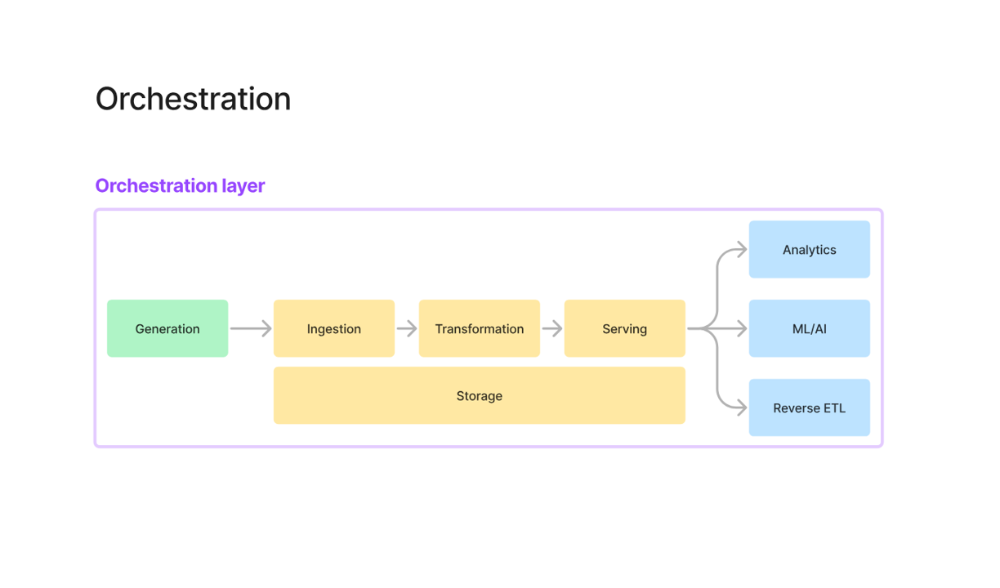
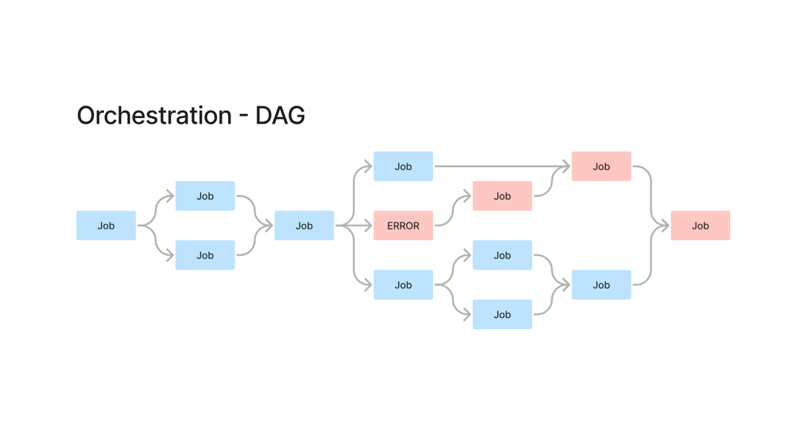
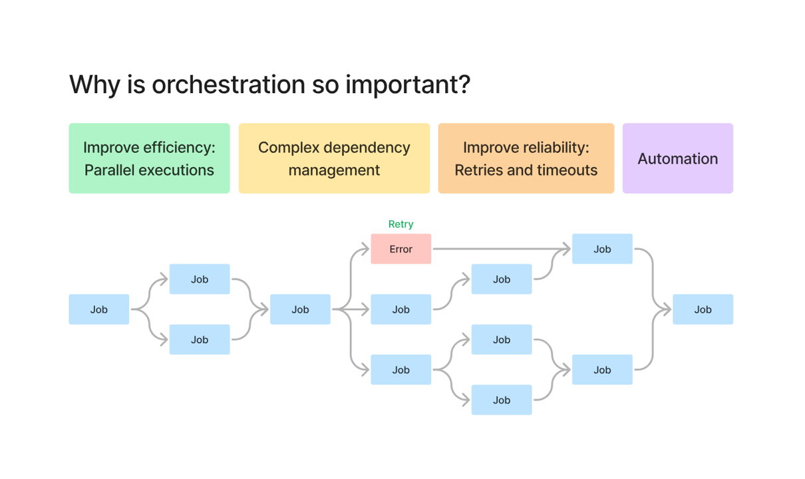
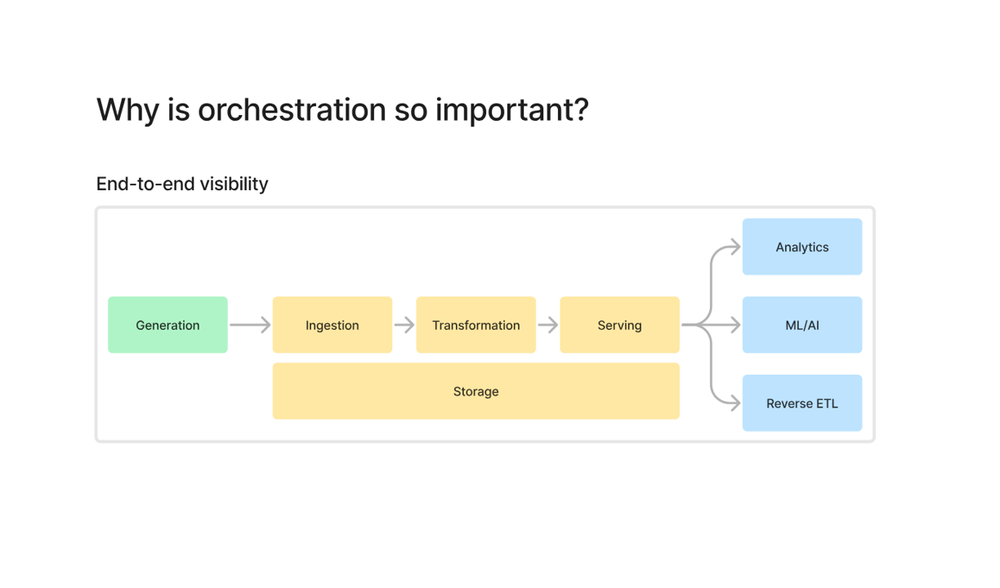
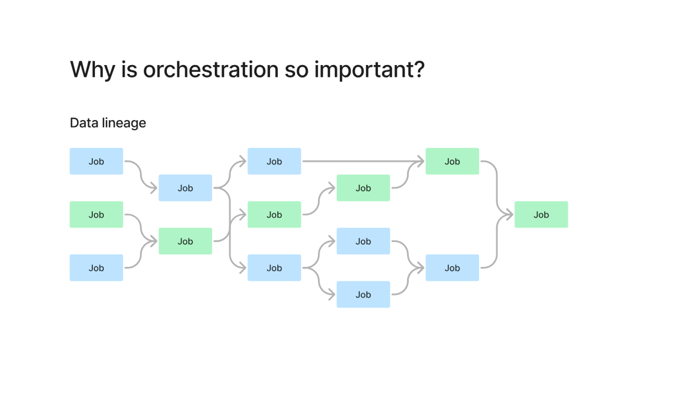
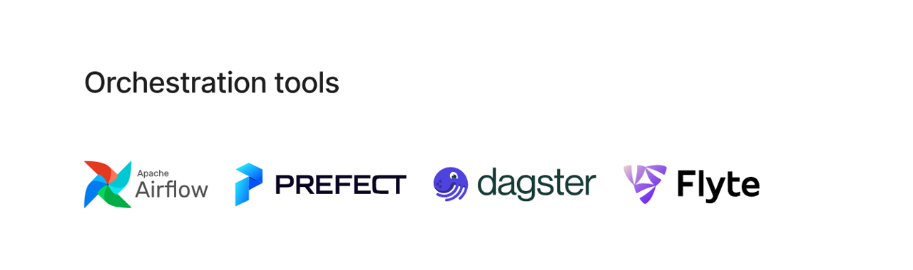

# Orchestration in Data Engineering

## What is Orchestration?

Orchestration is the **central control layer** that manages and coordinates data pipeline tasks from ingestion to serving.

It acts as a **command and control system** for executing, scheduling, and monitoring data workflows.

> In production systems, orchestration is essential for reliability, scalability, and maintainability.

---

## Orchestration Layer in Data Pipeline

Orchestration sits on top of the entire pipeline:

- Generation
- Ingestion
- Transformation
- Serving

It manages how and when each step runs.

---

## DAG (Directed Acyclic Graph)

A DAG represents the workflow of tasks.

### Definition:
A Directed Acyclic Graph (DAG) is a set of tasks organized in a graph where:
- Each task has dependencies
- Execution follows a defined order
- No cycles exist

### Key Idea:
- Tasks can run **sequentially or in parallel**
- Failures can be handled gracefully

---

## Why Orchestration is Important

### 1. Improves Efficiency
- Enables **parallel execution**
- Reduces total pipeline runtime

### 2. Dependency Management
- Handles complex workflows
- Ensures correct execution order

### 3. Reliability
- Built-in **retries**
- Timeout handling
- Failure management

### 4. Automation
- Scheduled execution
- Ensures **data freshness**

---

## End-to-End Visibility

Orchestration provides:
- Full pipeline monitoring
- Debugging capabilities
- Execution tracking

This helps identify:
- Failed jobs
- Delayed pipelines
- Broken dependencies

---

## Data Lineage

Orchestration helps track:
- How data flows across tasks
- Which job depends on which data

### Example:
If a value changes:
- You must trace from source → transformation → reporting

> Note: Full lineage is usually handled by metadata/catalog tools.

---

## Cron Jobs vs Orchestration

### Cron Jobs:
- Simple scheduling
- No dependency management
- Manual error handling

### Orchestration:
- Handles dependencies
- Automatic retries
- Scalable workflows

---

## Orchestration Tools

Popular tools:

- Apache Airflow (most widely used)
- Prefect
- Dagster
- Flyte

### Note:
Airflow was one of the earliest tools but has architectural limitations.
Modern tools improve:
- Observability
- Developer experience
- Scalability

---

## Key Takeaways

- Orchestration is critical for production data systems
- DAG defines workflow execution
- Improves reliability, efficiency, and automation
- Provides visibility and debugging capabilities
