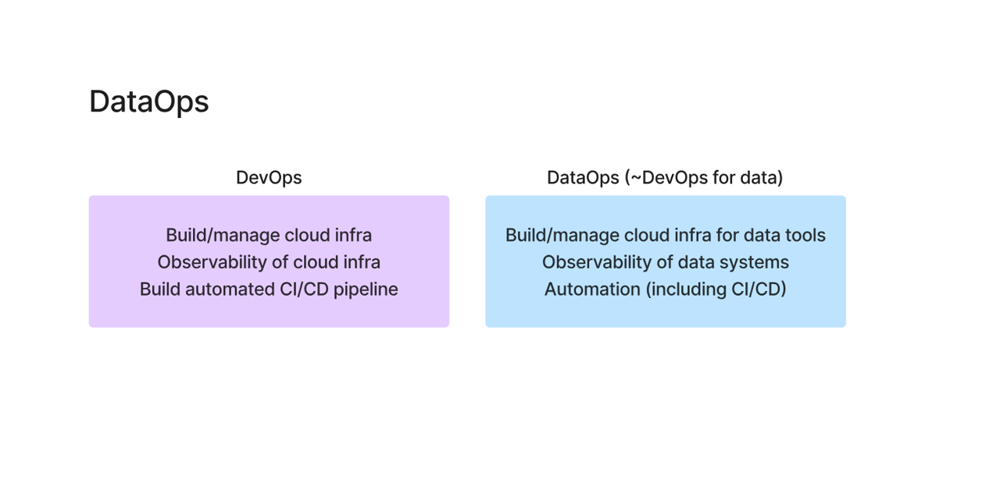
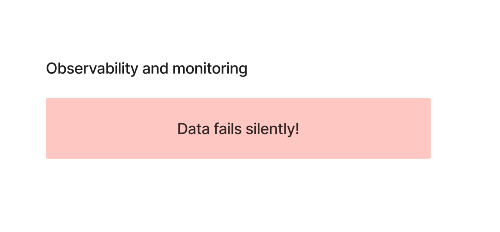
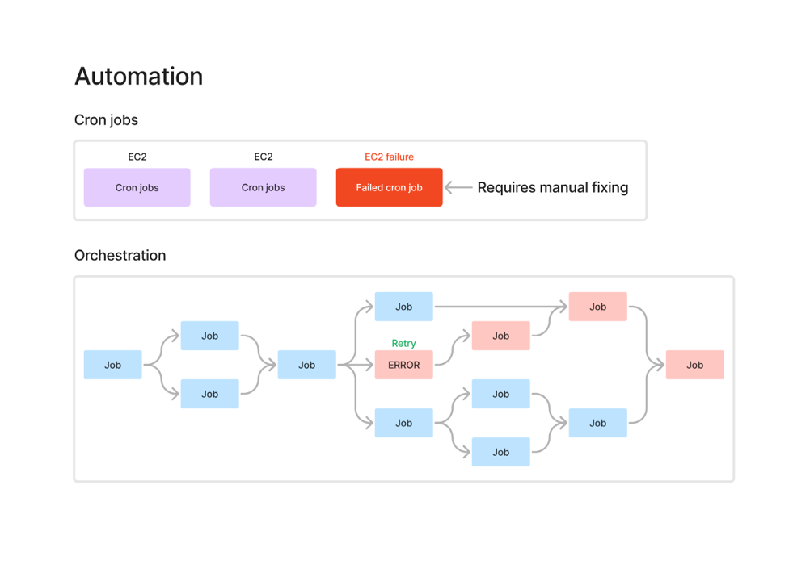
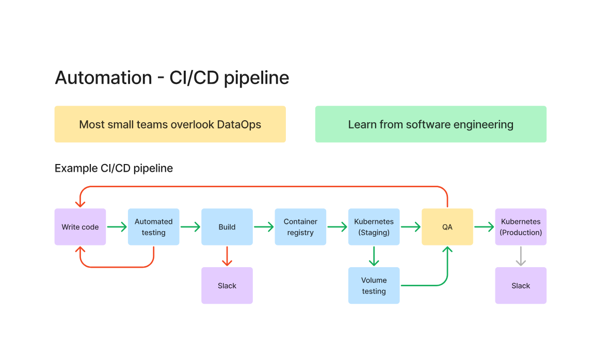

# DataOps

## What is DataOps?

DataOps is essentially **DevOps applied to Data Engineering**.

Just like DevOps focuses on:
- Building and managing cloud infrastructure
- Observability of systems
- Automating CI/CD pipelines

👉 DataOps focuses on:
- Building and managing **data infrastructure**
- Observability of **data pipelines and systems**
- Automating **data workflows and deployments**

---

## Key Components of DataOps

### 1. Infrastructure
Managing cloud resources required for:
- Data pipelines
- Storage systems
- Data processing tools

---

### 2. Observability & Monitoring

⚠️ **Important Concept: Data fails silently**

Unlike software systems:
- If an app fails → it crashes (visible immediately)

But in data systems:
- Pipelines can fail silently
- Data may become stale, incomplete, or incorrect
- Consumers may still see dashboards without realizing the issue

### Real-world problem:
- A pipeline failed 2 weeks ago
- Dashboard is still working
- Business decisions are made on **incorrect data**

👉 That’s why observability is critical

---

### What to Monitor?
- Pipeline success/failure
- Data freshness (is data updated?)
- Data quality (nulls, duplicates, anomalies)
- Latency (delays in pipeline)

---

## 3. Automation

### Cron Jobs

- Used for scheduling jobs (e.g., every 1 hour)
- Simple and easy to set up

❌ Problems:
- No dependency management
- No retry mechanism
- Failures require manual intervention
- Hard to manage at scale

---

### Orchestration (Better Approach)

Tools:
- Airflow
- Dagster
- Prefect

✔ Handles:
- Job dependencies
- Automatic retries
- Error handling
- Pipeline visibility

👉 Example:
If one job fails → system retries automatically  
If still fails → downstream jobs can be stopped

---

## 4. CI/CD for Data Pipelines

⚠️ Many teams ignore this — BIG mistake

### Why CI/CD in Data Engineering?

Data systems include:
- SQL transformations
- Python scripts
- Pipeline orchestration code

These need:
- Version control
- Testing
- Deployment automation

---

### Learn from Software Engineering

Software teams already solved this problem.

Typical CI/CD flow:
1. Write code
2. Run automated tests
3. Build artifacts
4. Deploy to staging
5. QA testing
6. Deploy to production

👉 Same should be applied to data pipelines

---

## Example in Data Engineering

- Write SQL (dbt / ODI)
- Test transformations
- Validate data quality
- Deploy to production pipelines

---

## Where DataOps Fits in Data Pipeline

| Stage | Role of DataOps |
|------|--------|
| Ingestion | Monitor data arrival |
| Transformation | Validate data correctness |
| Serving | Ensure data freshness |
| Entire Pipeline | Automation + Observability |

---

## Key Takeaways

- DataOps = DevOps for data systems
- Data failures are **silent**, not obvious
- Observability is **mandatory**, not optional
- Cron jobs don’t scale → orchestration is needed
- CI/CD is critical for reliable data pipelines
- Learn best practices from software engineering

---

## Interview Insight

👉 If asked: *“Why is DataOps important?”*

Answer:
> Because data systems don’t fail loudly like applications. Without proper monitoring, automation, and CI/CD, incorrect data can silently impact business decisions.
