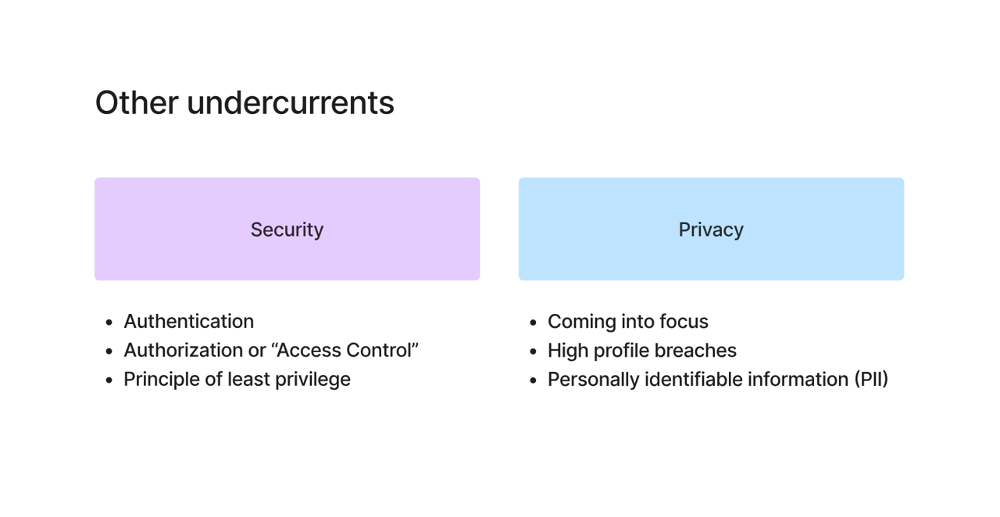
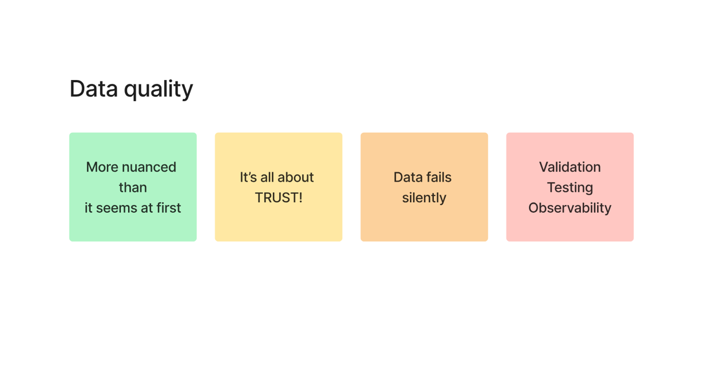
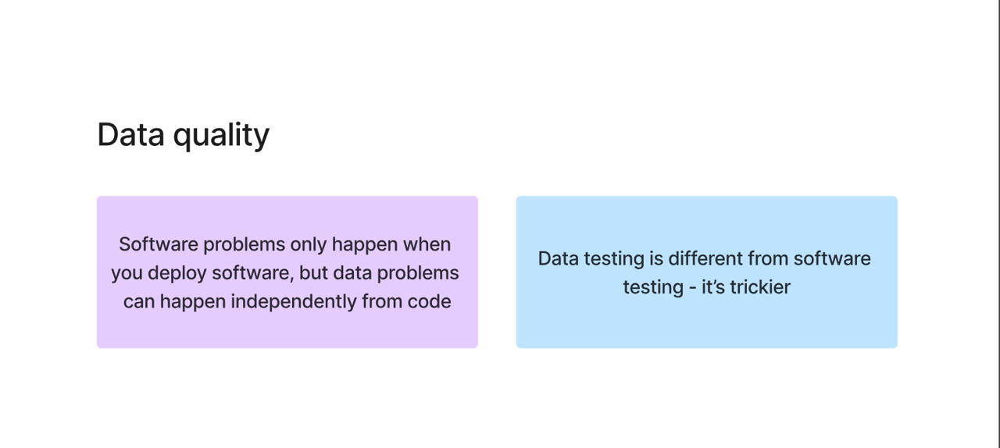

# Data Engineering Undercurrents: Security, Privacy & Data Quality

---

## 1. Security

Security in data engineering focuses on protecting systems and data from unauthorized access.

### Key Concepts

**Authentication**  
Confirms that the user is who they claim to be.  
Example: Login using username/password or IAM credentials.

**Authorization (Access Control)**  
Determines what actions a user is allowed to perform.  
Example: Read-only access vs Admin access.

**Principle of Least Privilege**  
Users should only have the minimum permissions required to perform their tasks.  
Example: A junior engineer should not have full admin access.

---

### Important Note

Security is not about being 100% secure.

> It is about reducing risk using multiple layers of protection.

---

## 2. Privacy

Privacy focuses on protecting sensitive user data.

### Why Privacy Matters
- Increasing digital data generation  
- Frequent data breaches  
- Legal and regulatory requirements  

---

### Personally Identifiable Information (PII)

PII is any data that can identify an individual.

Examples:
- Name  
- Email  
- Phone number  

---

### Best Practices
- Minimize collection of sensitive data  
- Protect stored data  
- Restrict access to authorized users  

---

## 3. Data Quality Overview

Data quality is one of the most critical aspects of data engineering.

> It is all about **trust**.

If trust is lost:
- Users stop using dashboards  
- They rely on raw data instead  

---

### Key Insight

> Data fails silently.

Unlike software systems:
- Software crashes visibly  
- Data pipelines may fail without clear signals  

---

## 4. Data Quality Challenges

Data quality problems are harder to detect compared to software bugs.

### Why Data Quality is Difficult

- Issues are often subtle  
- Problems can occur without code changes  
- Requires continuous monitoring  

---

### Data vs Software Problems

**Software Engineering**
- Issues happen during deployment  
- Bugs are easier to detect  

**Data Engineering**
- Issues can happen anytime  
- Often involves statistical anomalies  

---

### Real-World Scenarios

**Case 1: Sudden spike in sales**
- Could be real business growth  
- Could be a pipeline bug  

**Case 2: Zero sales**
- Could be no user activity  
- Could be pipeline failure  

---

## 5. Ensuring Data Quality

### Validation
Check whether data is correct  
Example: Null checks, constraints  

### Testing
Ensure transformation logic works correctly  

### Observability
Monitor pipelines to detect failures and anomalies  

---

## Final Takeaways

- Security → Protects access  
- Privacy → Protects sensitive data  
- Data Quality → Ensures trust  

> Without trust, data engineering systems lose their value.
