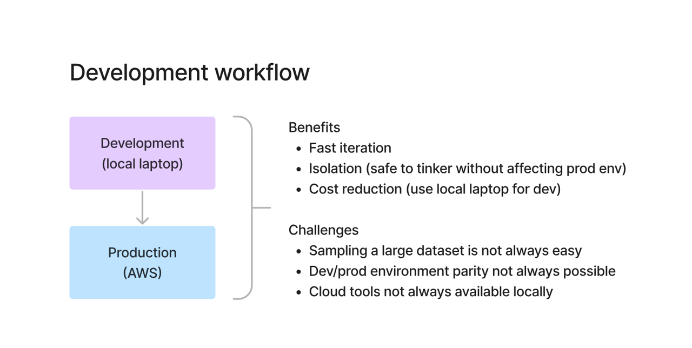

# Data Engineering Undercurrents: Development Workflow

---

## Development Workflow Overview

---

## What is Development Workflow?

Development workflow defines how data engineers build, test, and deploy data pipelines from development environments to production systems.

---

## Typical Setup

- **Development Environment** → Local laptop  
- **Production Environment** → Cloud (AWS, OCI, etc.)

---

## Benefits of Local Development

- **Fast Iteration**  
  Quickly test and modify code without deployment delays  

- **Isolation**  
  Safe environment without impacting production systems  

- **Cost Reduction**  
  No need to use cloud resources for every small change  

---

## Challenges in Data Engineering

### 1. Large Datasets
- Production data is huge  
- Difficult to replicate or sample accurately in local systems  

---

### 2. Environment Parity Issues
- Local and production environments are not identical  
- Differences can cause unexpected issues  

---

### 3. Cloud Dependency
- Many tools (S3, distributed systems) are cloud-based  
- Cannot fully replicate them locally  

---

## Key Insight

> In data engineering, full local development is not always possible.

---

## Best Practice: Hybrid Approach

- Develop logic locally (SQL, Python, transformations)  
- Test with small/sample data  
- Validate and scale in cloud environments  

---

## Final Takeaways

- Local development improves speed and efficiency  
- Production environments handle scale and reliability  
- A combination of both is required in real-world data engineering
