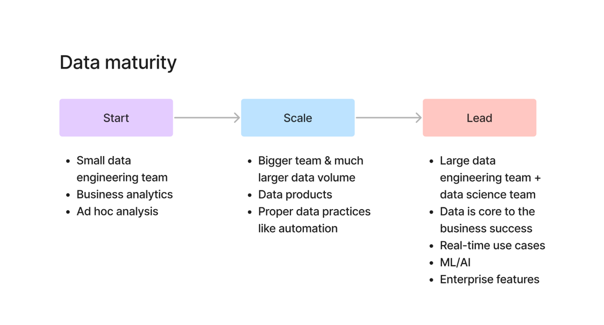

# 📘 Data Maturity Levels

---

## 📌 What is Data Maturity?

Data maturity defines **how advanced a company is in using data**.

👉 Not every company uses data the same way.
👉 Your job as a Data Engineer depends on this level.

---

## 🔁 3 Levels of Data Maturity

### 1️⃣ Start Stage (Beginner Level)

👉 Think: Small startup or early-stage company

**Characteristics:**

* Small data engineering team (or none)
* Mostly **business analytics**
* Ad-hoc queries (manual work)
* Data is messy and not well-structured

**Your Work as Data Engineer:**

* Writing SQL queries
* Cleaning data manually
* Supporting analysts
* Basic pipelines (sometimes none)

**Example:**

* Excel reports
* Manual dashboards
* One database

---

### 2️⃣ Scale Stage (Growing Company)

👉 Think: Mid-size company growing fast

**Characteristics:**

* Larger team
* More data volume
* Data pipelines are built
* Automation starts
* Data products are created

**Your Work as Data Engineer:**

* Build ETL pipelines
* Automate workflows
* Handle multiple data sources
* Improve performance

**Example:**

* Airflow pipelines
* Data warehouse (Snowflake/Redshift)
* Scheduled jobs

---

### 3️⃣ Lead Stage (Advanced / Enterprise)

👉 Think: Big tech companies (Amazon, Netflix)

**Characteristics:**

* Large data engineering + data science teams
* Data is **core to business**
* Real-time systems
* ML/AI heavily used
* Enterprise-level systems

**Your Work as Data Engineer:**

* Build scalable systems
* Real-time data pipelines (Kafka, Flink)
* Support ML/AI use cases
* Focus on reliability, performance, and cost

**Example:**

* Real-time recommendations
* ML pipelines
* Streaming data systems

---

## 🧠 Simple Way to Remember

* **Start → Basic & Manual**
* **Scale → Growing & Automated**
* **Lead → Advanced & Intelligent**

---

## 🎯 Why This is Important

👉 When you join a company, you must ask:

* What is the data maturity level?
* What kind of problems will I solve?
* What tools will I use?

👉 Because:

* Start → SQL heavy
* Scale → ETL + pipelines
* Lead → Distributed systems + real-time

---

## 🔥 Key Takeaways

* Not all companies are at the same level
* Your role changes based on maturity
* Tools and complexity increase with level
* Understanding this helps in:

  * Job selection
  * Interview answers
  * Career growth

---

## 🎯 Interview Questions

1. What is data maturity?
2. Explain different data maturity levels
3. How does a Data Engineer’s role change across levels?
4. Which stage uses real-time pipelines?

---

## 📚 Summary

* Data maturity = how advanced data usage is
* 3 levels: Start → Scale → Lead
* Higher maturity = more complexity + more impact

---

⭐ This helps you understand what kind of engineer you need to become
