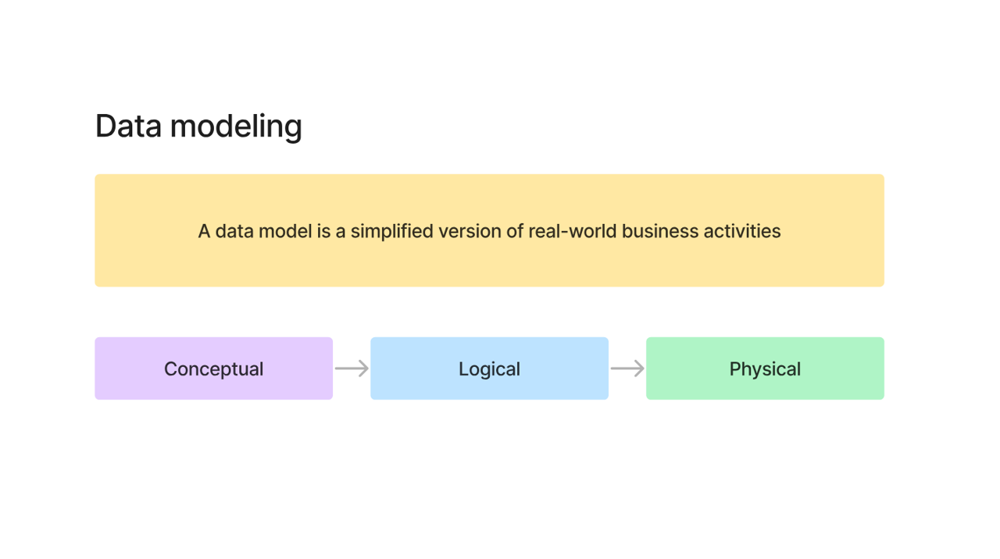
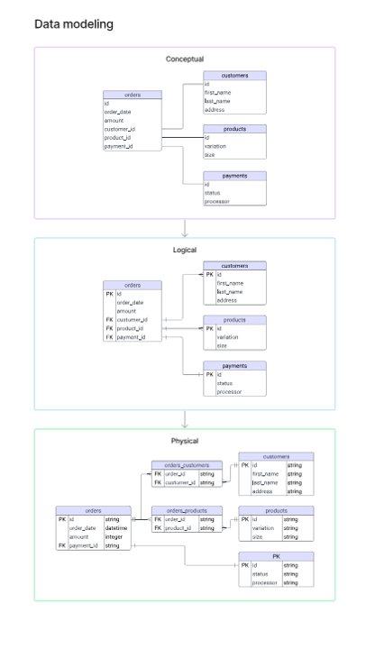
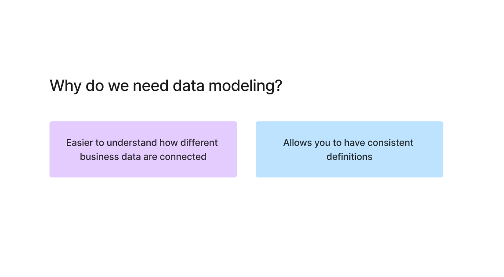
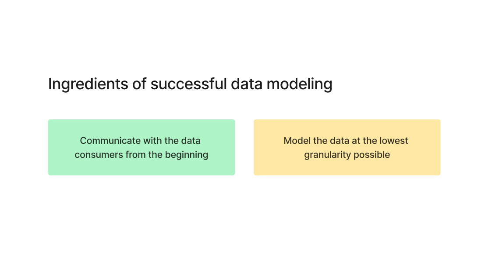
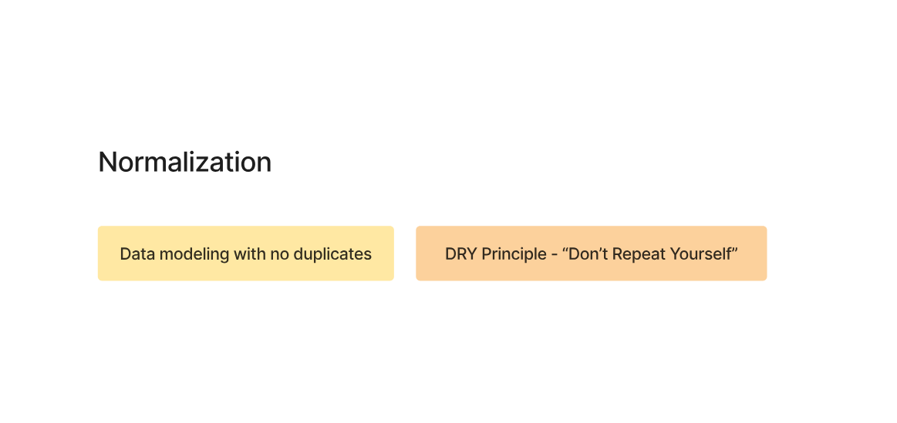
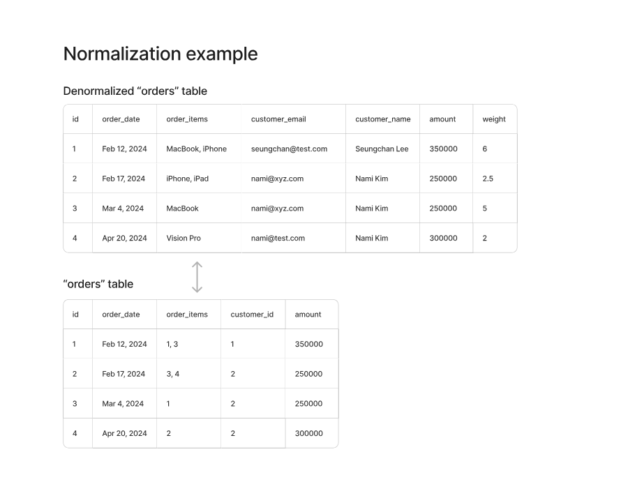
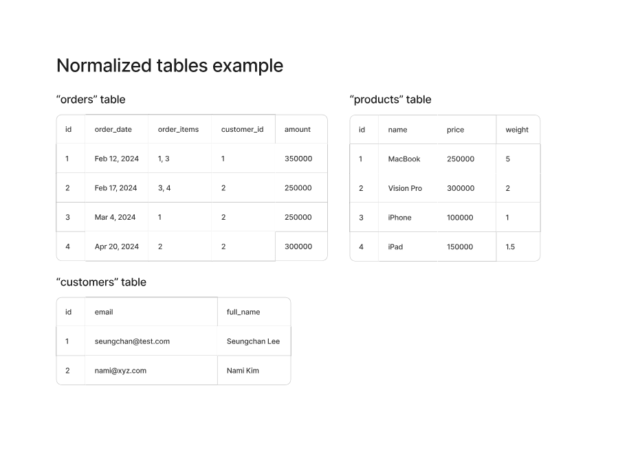
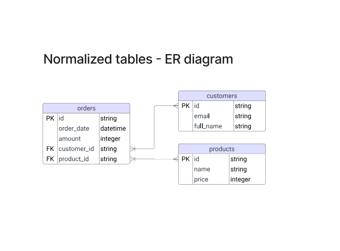
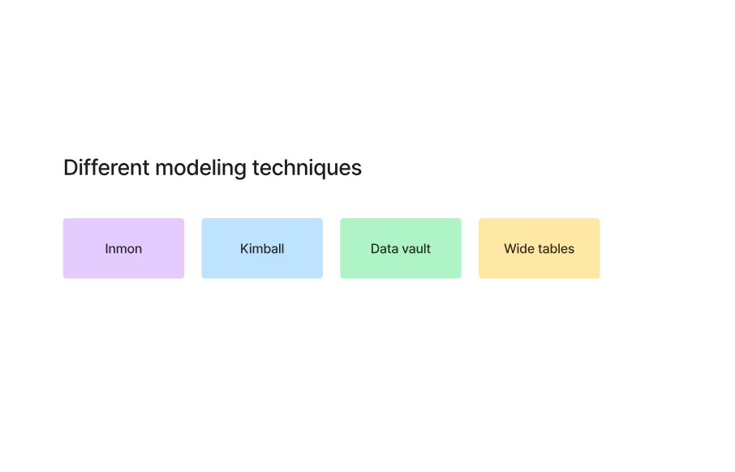
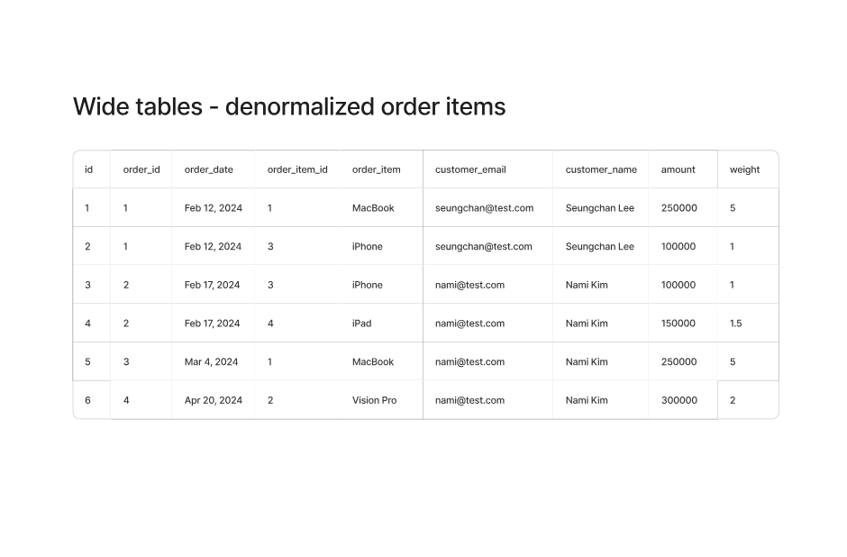

# 📘 Data Modeling

---

## 🧠 What is data modeling

A data model is basically:
👉 a simplified version of real-world business

We are just converting messy real-world stuff into structured tables.

---

## 🔄 Types of data modeling

Three levels:

* Conceptual → what data exists
* Logical → how data is related
* Physical → how it is actually stored

---

## 🤔 Why we even need this

* Understand how data is connected
* Keep definitions consistent

Otherwise everything becomes chaos very fast.

---

## ⚙️ What makes a good data model

* Talk to data consumers early
* Model at lowest granularity

👉 If granularity is wrong, everything breaks later

---

## 🧹 Normalization

Normalization = remove duplicates

Basically:
👉 Don’t store same data again and again

---

## ❌ Before normalization

Everything is mixed:

* customer info repeated
* product info repeated

This is messy.

---

## ✅ After normalization

Data is split:

* orders
* customers
* products

Now:
👉 No duplication
👉 Clean relationships

---

## 🔗 ER Diagram

This just shows how tables are connected using keys.

---

## 🧠 Different modeling approaches

* Inmon
* Kimball
* Data Vault
* Wide tables

---

## 💥 Now the reality check (important)

Highly normalized tables were designed when:

* storage was expensive
* compute was tightly coupled

So:
👉 duplication was avoided at all cost

---

## ⚡ Problem with highly normalized tables

You will have:

* too many tables
* too many joins

For analytics this is painful.

Example:
👉 simple query becomes 10 joins

---

## 🚀 Wide tables (denormalized)

Here we:
👉 intentionally duplicate data

Everything is kept in fewer tables.

---

## 📊 Fully denormalized example

Now:

* customer + product + order in one place

No joins needed.

---

## ⚡ Why wide tables are actually preferred now

### 1. Storage is cheap

Earlier:

* duplication = expensive

Now:

* duplication = fine

---

### 2. Faster analytics

Instead of:

* joining 10 tables

We:
👉 scan 1 table

Huge performance difference.

---

### 3. Simpler queries

* easier to write
* easier to debug

---

## 🔥 My takeaway

* Normalization is clean but slow for analytics
* Wide tables are messy but fast

👉 For OLTP → normalization makes sense
👉 For OLAP → wide tables win

---
