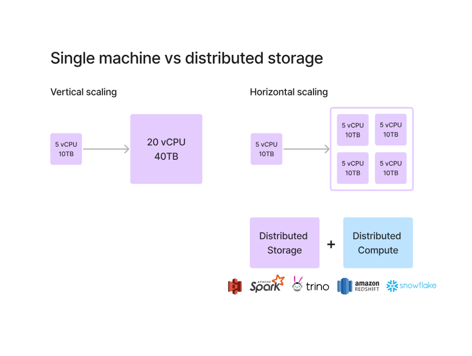
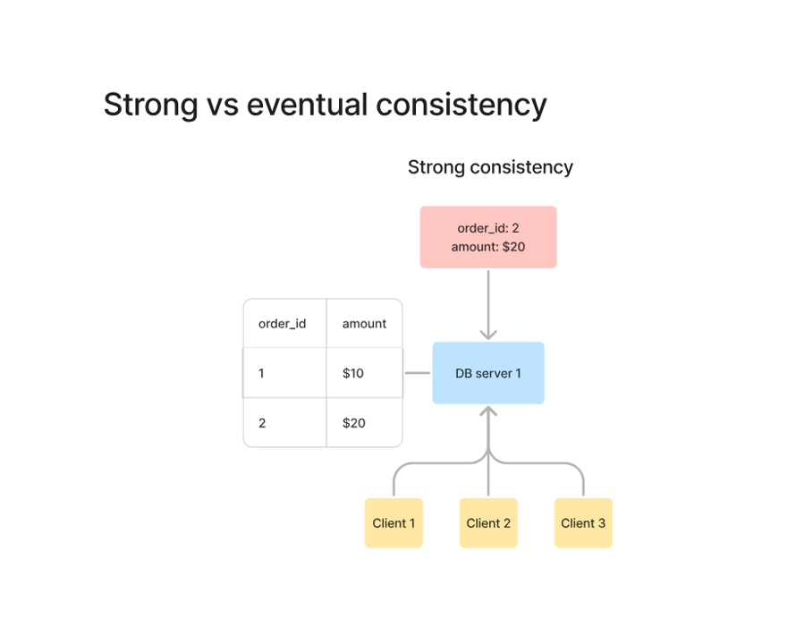
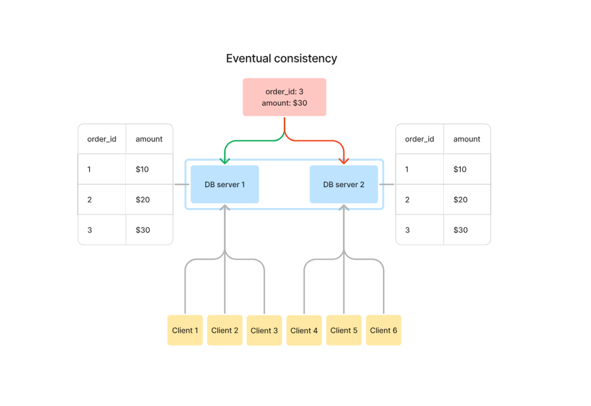
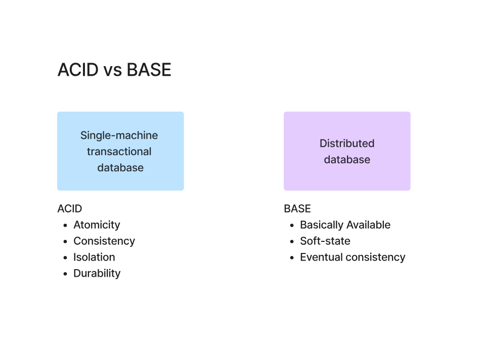

# 📘 Challenges with Distributed Systems

---

## 📌 Why Distributed Systems are Challenging

Distributed systems help in **scalability and performance**, but they introduce trade-offs:

* Data inconsistency
* Network delays
* Synchronization issues
* Complex system design

---

## ⚙️ Single Machine vs Distributed Storage

### 🖥️ Single Machine (Vertical Scaling)

* Increase CPU, RAM, Storage
* Limited by hardware
* Easier to manage

### 🌐 Distributed System (Horizontal Scaling)

* Multiple machines
* Better scalability
* Fault tolerance

👉 Trade-off: More complexity

---

## 🔁 Strong Consistency

👉 Definition:

> All users see the **same data at the same time**

### Example:

* Order ID = 2 → Amount = $20
* Client 1, 2, 3 → ALL get $20 immediately

### ✅ Advantage:

* Accurate data
* No confusion

### ❌ Disadvantage:

* Slower systems
* Hard to scale

---

## ⏳ Eventual Consistency

👉 Definition:

> Data will become consistent **after some time**

### Your Example (Refined):

* Order ID = 3 → Amount = $30
* DB Server 1 → Updated immediately
* DB Server 2 → Delayed update

### Scenario:

* Client 3 → gets $30
* Client 6 → “No record found” ❌

👉 After some time:

* Both servers sync
* All clients get $30 ✅

---

### ⚠️ Important Insight:

> Eventual consistency does NOT guarantee time — only eventual correctness

---

## ⚖️ Strong vs Eventual (Simple Memory)

* Strong → **Same data, same time**
* Eventual → **Same data, different time**

---

## 🧠 ACID vs BASE

### 🟦 ACID (Traditional Databases)

* Atomicity → All or nothing
* Consistency → Always valid state
* Isolation → No interference
* Durability → Data is permanent

👉 Used in:

* Banking systems
* Transactional systems

---

### 🟪 BASE (Distributed Systems)

* Basically Available
* Soft State
* Eventual Consistency

👉 Used in:

* Large-scale systems
* Distributed databases

---

## 🔥 Core Trade-Off

👉 Distributed systems sacrifice:

* Immediate consistency

👉 To gain:

* Scalability
* Availability

---

## 🎯 Key Takeaways

* Single machine = simple but limited
* Distributed system = scalable but complex
* Strong consistency = accurate but slow
* Eventual consistency = fast but delayed accuracy
* ACID vs BASE = strict vs flexible systems

---

## 🎯 Interview Questions

1. Difference between vertical and horizontal scaling
2. Strong vs eventual consistency
3. What is ACID vs BASE?
4. Why do distributed systems use eventual consistency?

---

## 📚 Summary

* Distributed systems introduce complexity
* Trade-offs are unavoidable
* Understanding these trade-offs is key to system design

---

⭐ This is a **core system design concept**
