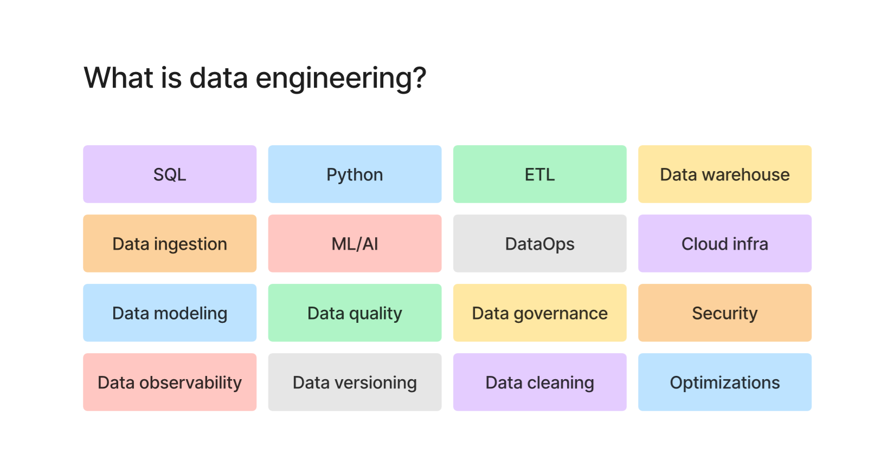
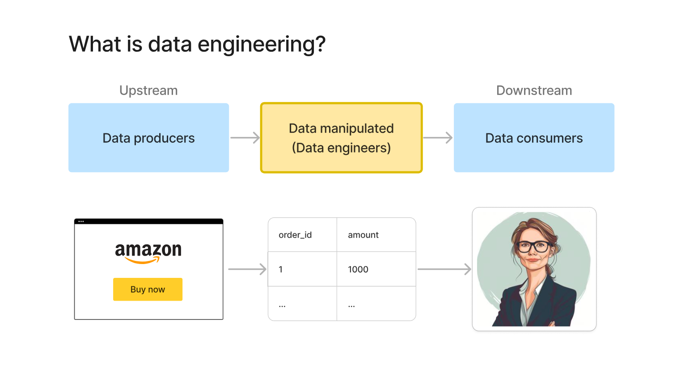
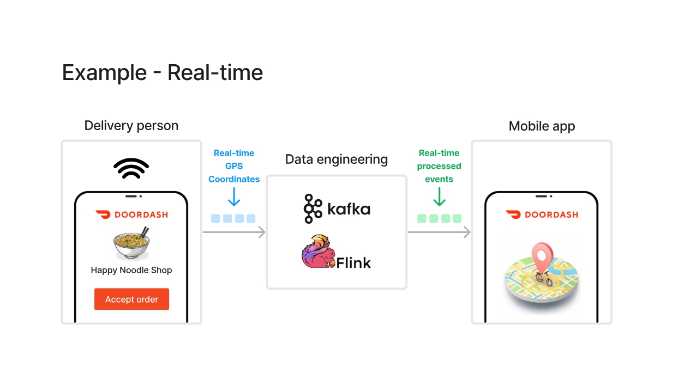
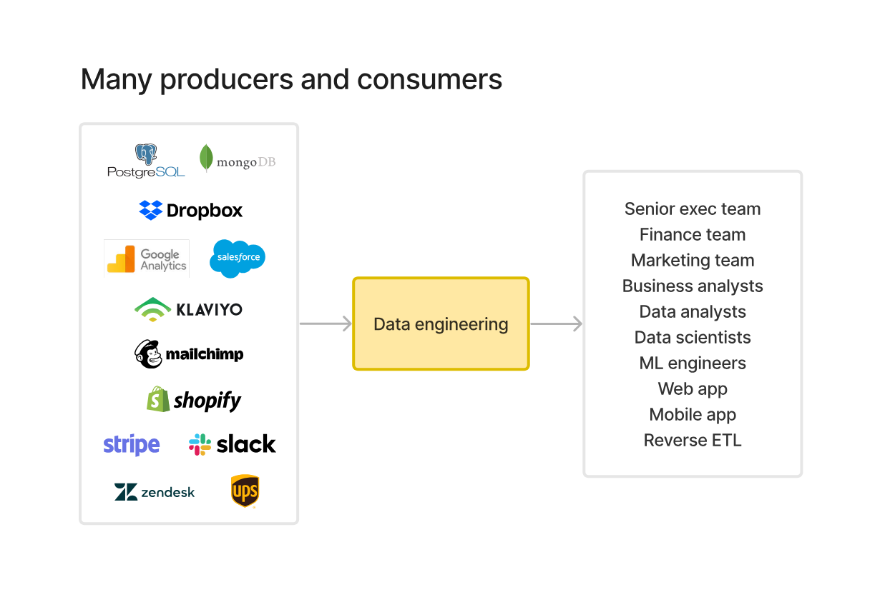
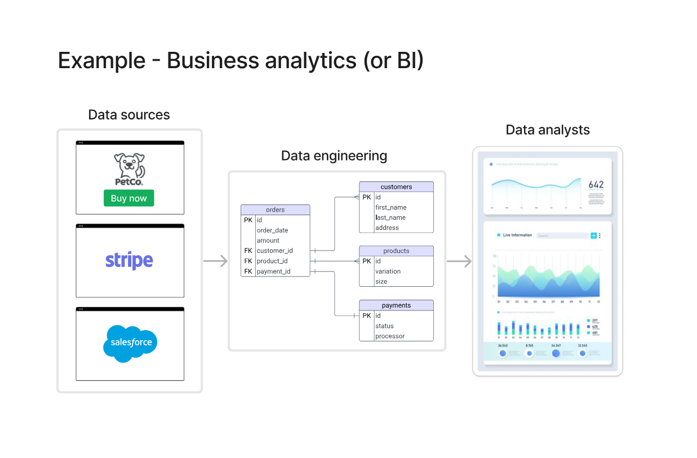
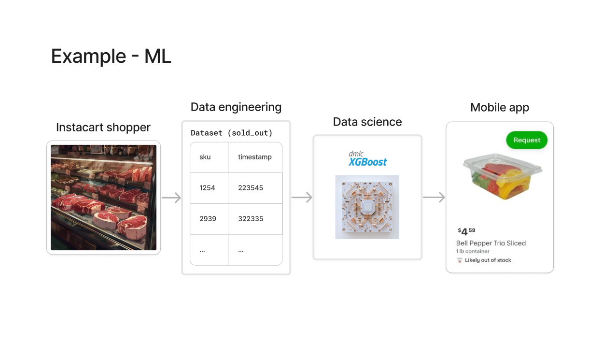
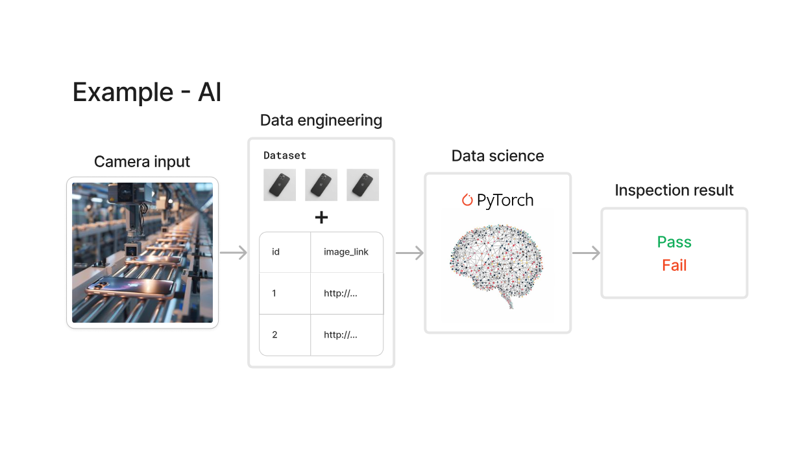
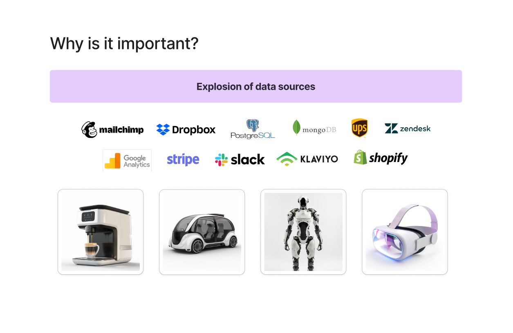
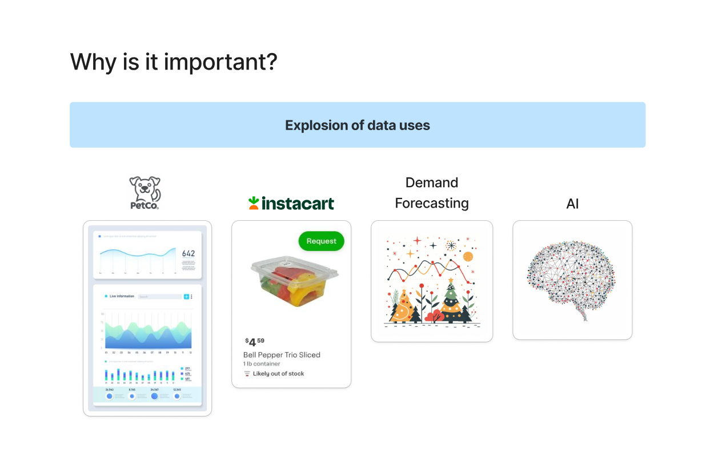

# 📘 Lecture 01: What is Data Engineering?

---

## 📌 What is Data Engineering?

Data Engineering is the process of **collecting, transforming, and delivering data** so that it can be used by:

* Data analysts
* Data scientists
* Business teams
* Applications

👉 In simple terms:

> Data Engineers build systems that move data from **raw data → usable data**

---

## 🔁 Data Flow (Upstream → Downstream)

* **Upstream (Data Producers)**
  Apps, websites, APIs generate data

* **Data Engineers (Processing Layer)**
  Transform and prepare data

* **Downstream (Data Consumers)**
  Analysts, ML models, dashboards use it

---

## ⚙️ Key Components in Data Engineering

Data Engineering involves multiple areas:

* SQL
* Python
* ETL
* Data Warehouse
* Data Ingestion
* Cloud Infrastructure
* Data Modeling
* Data Quality
* Data Governance
* Data Cleaning
* Data Observability
* Data Versioning
* Optimization

---

## 🌍 Real-Time Example

Example: Food delivery tracking

* Delivery partner sends GPS data
* Data is processed in real-time (Kafka, Flink)
* App shows live location

👉 This is **real-time data engineering**

---

## 🏢 Many Producers & Consumers

### Data Sources:

* PostgreSQL, MongoDB
* Stripe, Shopify
* Google Analytics
* Salesforce

### Data Consumers:

* Analysts
* Data scientists
* Business teams
* Apps

👉 Data Engineers connect everything

---

## 📊 Business Analytics Example (BI)

* Data from multiple systems
* Organized into tables
* Used for dashboards and reporting

---

## 🤖 Machine Learning Example

* Data Engineers prepare datasets
* Data Scientists train models
* Output used in applications

---

## 🧠 AI Example

* Images/data collected
* Processed and stored
* ML model gives output (Pass/Fail)

---

## ❗ Why is Data Engineering Important?

### Explosion of Data Sources

* Many platforms generate data
* Data volume is increasing rapidly

---

### Explosion of Data Usage

* Dashboards
* Forecasting
* AI/ML
* Business decisions

---

## 🔥 Key Takeaways

* Data Engineering = backbone of data systems
* Connects producers → consumers
* Makes data usable
* Enables analytics and AI

---

## 🎯 Interview Questions

1. What is Data Engineering?
2. What does a Data Engineer do?
3. What are upstream and downstream systems?
4. Why is Data Engineering important?

---

## 📚 Summary

* Raw data is useless without processing
* Data Engineers make it valuable
* Everything (AI, analytics) depends on it

---

⭐ Foundation topic — very important
