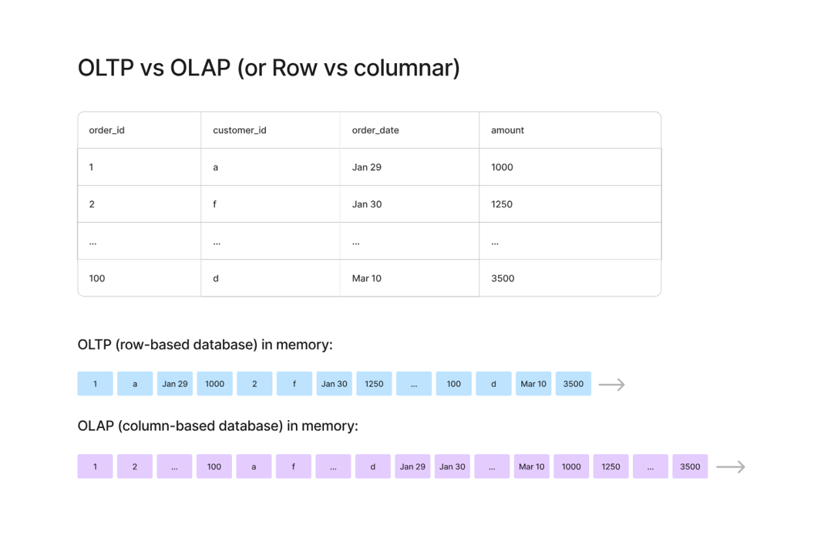
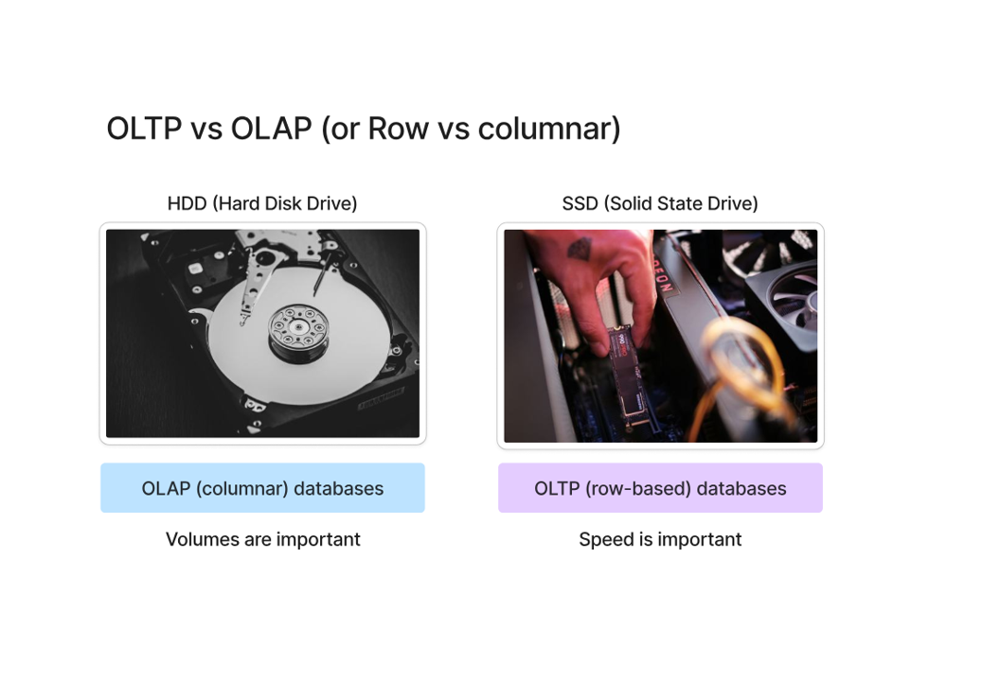

# 📘 OLTP vs OLAP (Row vs Column)

---

## 🤯 What actually surprised me

I was completely confused at first.

I thought:

* OLAP = row-based
* OLTP = column-based

But that didn’t even make sense when I thought about the use case.

Then I realized I mixed it up.

👉 Correct is:

* **OLTP → Row-based**
* **OLAP → Column-based**

---

## 🧠 First, what is happening here?



We have a normal table:

* order_id
* customer_id
* order_date
* amount

Now the question is:

👉 How is this data stored in memory?

---

## ⚡ OLTP (Row-based)



👉 In OLTP, data is stored **row by row**

So memory looks like:

```
1 | a | Jan 29 | 1000 → 2 | f | Jan 30 | 1250 → ...
```

---

### 💡 Why?

Because OLTP = **transactions**

Example:

* Insert order
* Update order
* Get full order

👉 Every time, we need the **entire row**

So storing row together = faster access

---

### 🧠 My understanding

If I want order_id = 2:

I need:

* customer_id
* date
* amount

👉 Everything is already together → fast

---

## 📊 OLAP (Column-based)

👉 In OLAP, data is stored **column by column**

So memory looks like:

```
order_id → 1, 2, 3...
customer_id → a, f, d...
amount → 1000, 1250, 3500...
```

---

### 💡 Why?

Because OLAP = **analytics**

Example:

* SUM(amount)
* AVG(amount)
* Count orders

👉 We don’t need full rows
👉 We need one column (mostly)

---

### 🧠 My understanding

If I want:

```
SUM(amount)
```

👉 Why should I scan:

* order_id
* customer_id
* date

❌ Waste of time

👉 Just scan `amount` column → fast

---

## ⚔️ Row vs Column (Clear Difference)

| Feature  | OLTP (Row)          | OLAP (Column)           |
| -------- | ------------------- | ----------------------- |
| Use case | Transactions        | Analytics               |
| Storage  | Row-based           | Column-based            |
| Speed    | Fast writes/updates | Fast reads/aggregations |
| Example  | Banking app         | Data warehouse          |

---

## 💥 The real insight (THIS CLICKED FOR ME)

👉 OLTP:

> “Give me THIS row”

👉 OLAP:

> “Give me THIS column for ALL rows”

---

## 🧠 HDD vs SSD analogy (from slide)


* OLAP → volume heavy → like HDD
* OLTP → speed heavy → like SSD

---

## 🔥 Final understanding

* OLTP = row-based because we deal with **complete records**
* OLAP = column-based because we deal with **aggregations**

---

## 🎯 Interview Questions

1. Why OLAP uses columnar storage?
2. Why OLTP uses row-based storage?
3. When to use OLAP vs OLTP?
4. Performance difference between row and column storage?

---

## 📌 Summary (my version)

* I initially mixed it up
* But logic made it clear
* Row = transactions
* Column = analytics

👉 That’s it. No need to overcomplicate.
