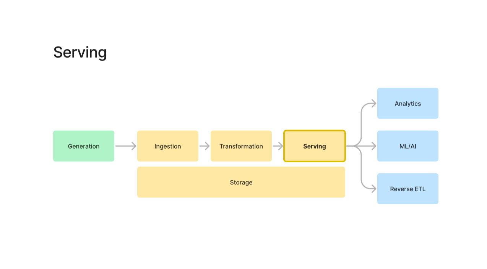
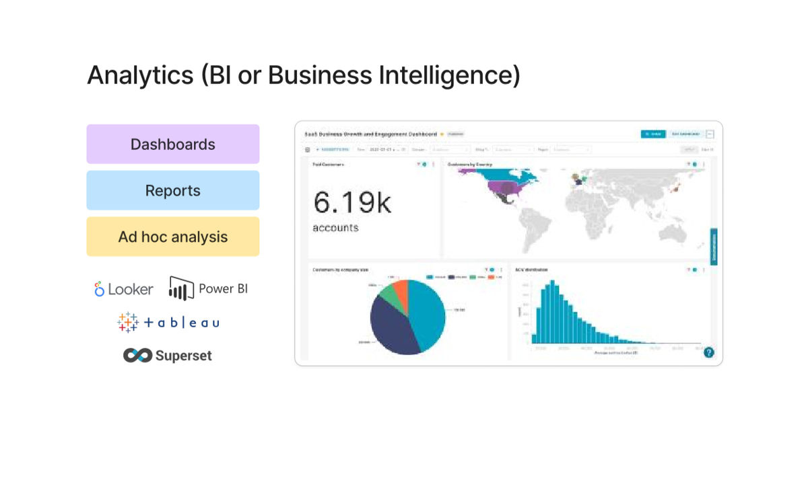
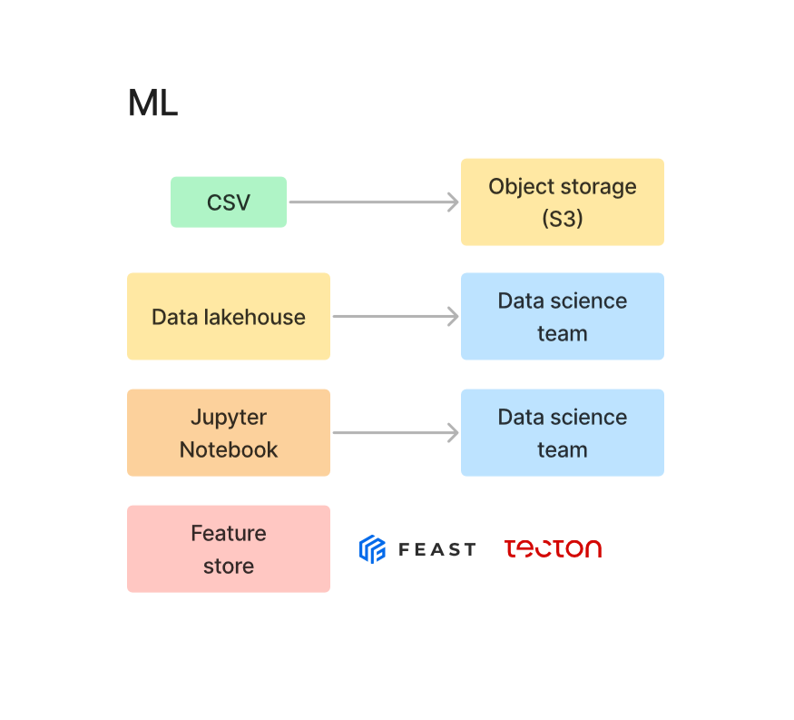
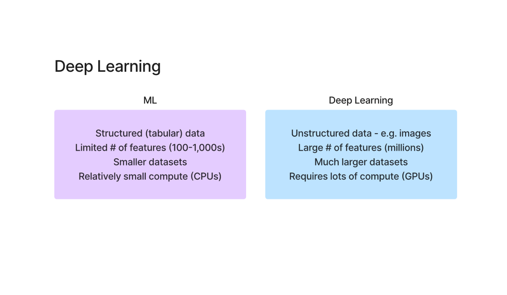
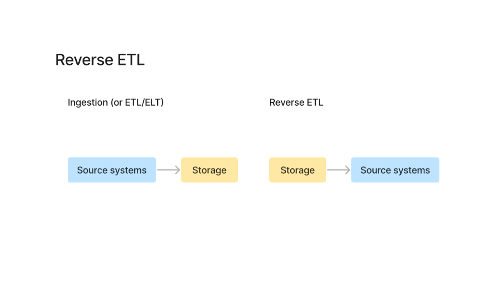

# 📤 Serving Layer (Final Step in Data Pipeline)

---

## 📌 What is Serving?



Serving is the final stage of the data pipeline where processed data is delivered to end users or systems.

```sql
Generation → Ingestion → Transformation → Serving
```

---

## 🎯 What happens in Serving?

Data is used for:

* Analytics (BI)
* Machine Learning (ML/AI)
* Reverse ETL

---

# 📊 1. Analytics (Business Intelligence)



### Includes:

* Dashboards
* Reports
* Ad-hoc analysis

### Tools:

* Looker
* Power BI
* Tableau
* Superset

### Purpose:

👉 Help business teams make decisions

---

# 🤖 2. Machine Learning (ML/AI)



### Flow:

```sql
CSV → S3 → Data Lakehouse → Data Science Team
```

---

## 🧠 Feature Store



* Feast
* Tecton

👉 Stores reusable ML features

---

## ⚖️ ML vs Deep Learning


| ML              | Deep Learning        |
| --------------- | -------------------- |
| Structured data | Unstructured data    |
| Fewer features  | Millions of features |
| CPU             | GPU                  |

---

# 🔄 3. Reverse ETL (CORE CONCEPT)



---

## 📌 What is Reverse ETL?

Reverse ETL = moving data **from warehouse → business tools**

---

## 🔁 Comparison

### Normal ETL:

```sql
Salesforce → Data Warehouse
```

### Reverse ETL:

```sql
Data Warehouse → Salesforce
```

---

## 🧠 Why Reverse ETL?

Warehouse contains:

* Cleaned data
* Transformed data
* Business logic

But business teams use:

* CRM (Salesforce)
* Marketing tools
* Support tools

👉 Reverse ETL connects both worlds

---

## 🔥 Real Example

1. Raw data → Warehouse

2. Transform:

   * LTV
   * Churn score
   * Segments

3. Reverse ETL sends:

   * High-value users → Salesforce
   * Churn users → Marketing

---

## ⚙️ How Reverse ETL Works

1. Query warehouse
2. Apply logic
3. Map fields
4. Sync to tools

---

## 🛠️ Tools

* Hightouch
* Census
* RudderStack
* Segment

---

## ⚡ Why Reverse ETL is Powerful

### 1. Activates Data

👉 Data is actually used

---

### 2. Single Source of Truth

👉 Warehouse controls all systems

---

### 3. No Manual Work

👉 No CSV exports

---

### 4. Faster Business Decisions

👉 Teams get ready-to-use data

---

## ⚠️ Critical Understanding

👉 Reverse ETL is NOT just syncing data

👉 It is:
**Sending enriched, business-ready data back to tools**

---

## 🔥 Key Insight (Interview Level)

Old approach:

* Data stays in warehouse

Modern approach:

* Data flows back into business systems

👉 This is why Reverse ETL is growing fast

---

## 🚀 Final Understanding

* ETL → brings data in
* Transformation → adds value
* Reverse ETL → delivers value

👉 Without Reverse ETL:
**Data is useless for business teams**

---
