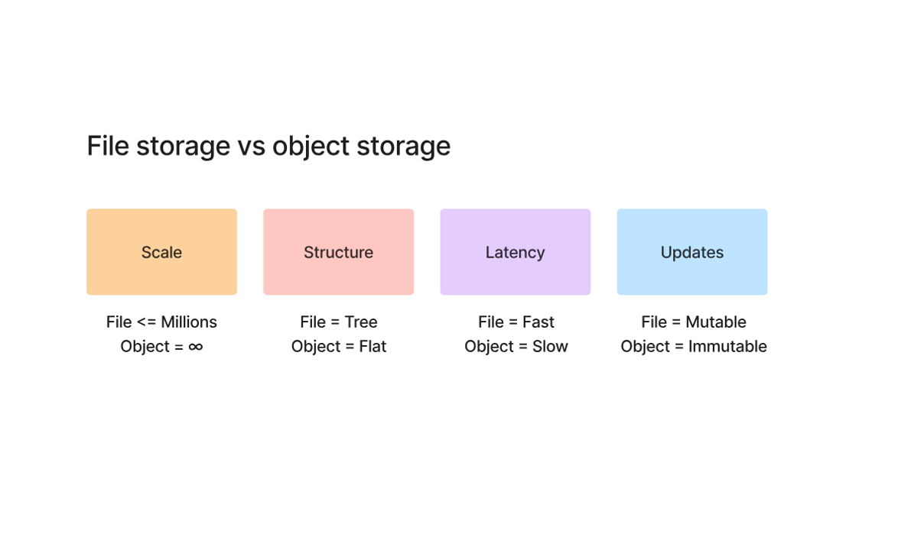
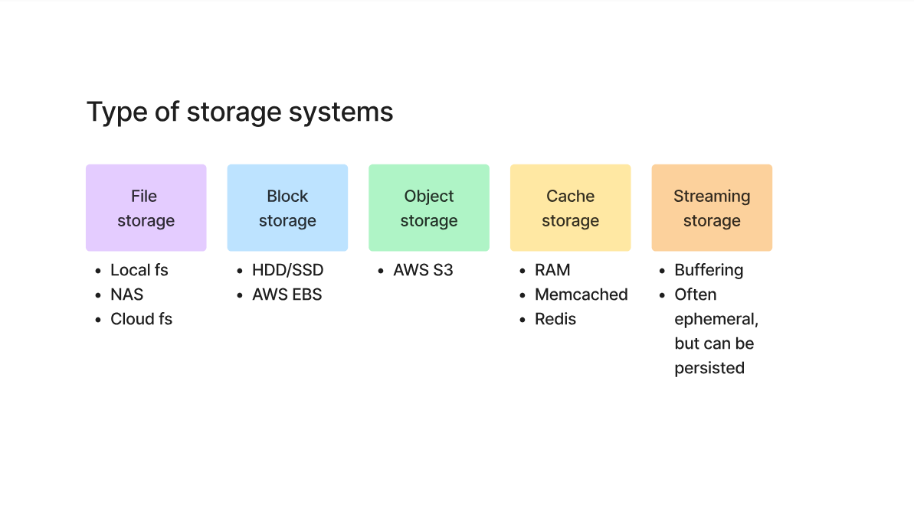

# 📘 Storage Systems & Object Storage (S3)

---

## 📌 What is a Storage System?

A **storage system** is any system used to **store and retrieve data**.

👉 Examples:

* Hard disk (HDD, SSD)
* Databases
* Cloud storage (S3)

---

## 📂 What is a File System?

A **file system** organizes data as **files and folders (tree structure)**.

### 🧠 Think:

> Like your laptop → folders inside folders

### Characteristics:

* Hierarchical (tree structure)
* Easy to navigate
* Supports updates (mutable)
* Limited scalability

### Examples:

* Local disk (C drive)
* NAS (Network storage)

---

## 🧱 What is Object Storage?

Object storage stores data as **objects (not files)**.

Each object contains:

* Data
* Metadata
* Unique ID

### 🧠 Think:

> Like storing photos in Google Drive / S3 with a unique link

### Characteristics:

* Flat structure (no folders)
* Massive scalability (almost infinite)
* Immutable (cannot update directly)
* Slower than file system

### Examples:

* AWS S3
* Azure Blob Storage

---

## ⚔️ File System vs Object Storage

### 🔹 Scale

* File → Limited (millions)
* Object → Virtually infinite

### 🔹 Structure

* File → Tree (folders)
* Object → Flat

### 🔹 Latency

* File → Fast
* Object → Slower

### 🔹 Updates

* File → Mutable
* Object → Immutable

---

## 🧠 Why Object Storage is Used in Data Engineering

👉 This is VERY IMPORTANT

### 1. Massive Data

* Data engineering deals with TBs–PBs
* File systems cannot scale like this

---

### 2. Cheap Storage

* S3 is much cheaper than databases or disks

---

### 3. Durability

* Data is replicated across regions

---

### 4. Perfect for Analytics

* Data is mostly:

  * Written once
  * Read many times

👉 So immutability is NOT a problem

---

### 5. Works with Big Data Tools

* Spark
* Hadoop
* Snowflake
* Redshift

---

## 📦 Types of Storage Systems

---

### 1️⃣ File Storage

* Local file system
* NAS
* Cloud file systems

---

### 2️⃣ Block Storage

* Raw disk storage
* Used in:

  * Databases
  * Operating systems

Examples:

* HDD / SSD
* AWS EBS

---

### 3️⃣ Object Storage

* Stores large-scale data
* Used in:

  * Data lakes
  * Analytics pipelines

Example:

* AWS S3

---

### 4️⃣ Cache Storage

👉 Temporary fast storage

Used for:

* Speeding up applications

Examples:

* RAM
* Redis
* Memcached

---

### 5️⃣ Streaming Storage (Important)

👉 This is NOT traditional storage

It stores **data in motion (real-time data)**

### Examples:

* Kafka
* Kinesis

### Use case:

* Real-time analytics
* Event processing

👉 Data is often:

* Temporary (ephemeral)
* Or later stored in S3

---

## 🔥 Key Insight (Very Important)

👉 File systems = good for applications
👉 Object storage = best for data engineering

---

## 🎯 Simple Memory Trick

* File system → “Folders & Files”
* Object storage → “Buckets & Objects”

---

## 🎯 Interview Questions

1. What is object storage?
2. Difference between file and object storage?
3. Why is S3 used in data engineering?
4. What is streaming storage?
5. What is cache storage?

---

## 📚 Summary

* Storage systems manage data
* File systems use hierarchy
* Object storage uses flat structure
* Data engineering prefers object storage due to scalability

---

⭐ This concept is fundamental for cloud & data engineering
