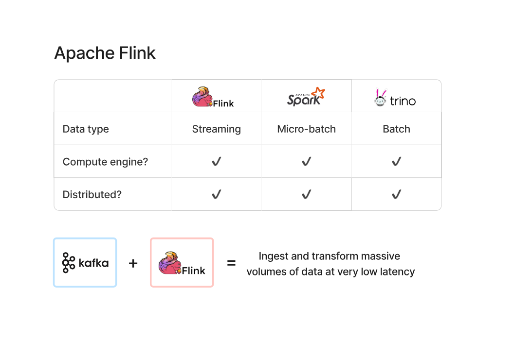
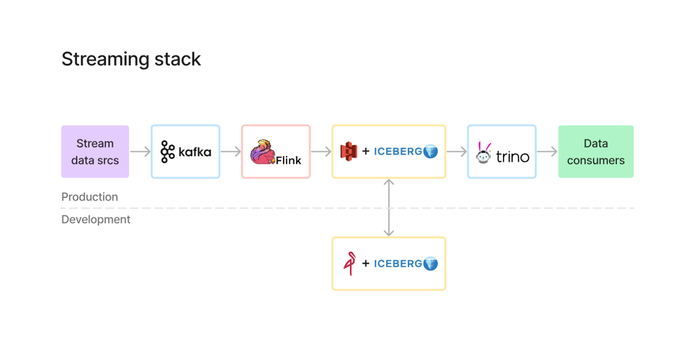
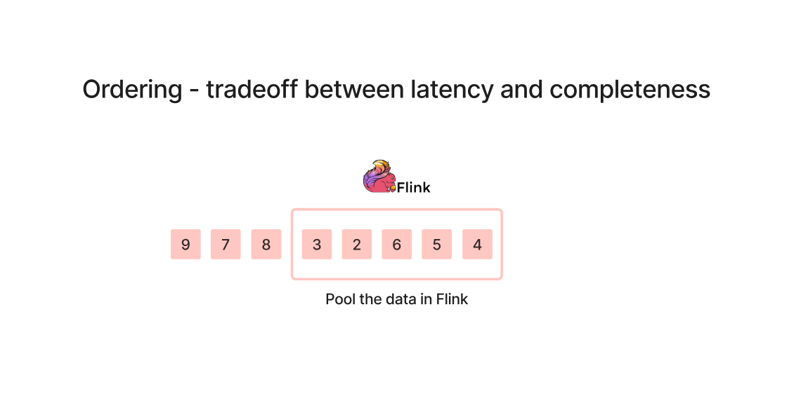

# Apache Flink & Streaming Processing

---

## 1. What is Apache Flink?

Apache Flink is a **distributed stream processing engine** designed for **low-latency, real-time data processing**.

---

## 2. Flink vs Spark vs Trino

| Feature        | Flink            | Spark             | Trino              |
|---------------|------------------|-------------------|--------------------|
| Data Type     | Streaming        | Micro-batch       | Batch              |
| Role          | Processing       | Processing        | Query Engine       |
| Latency       | Very Low         | Medium            | Depends on query   |
| Distributed   | Yes              | Yes               | Yes                |

---

### Key Understanding

- **Flink** → True real-time streaming  
- **Spark** → Processes small batches (not real-time)  
- **Trino** → Used to query data (not processing engine)  

---

## 3. Kafka + Flink = Real-Time Pipeline

Kafka and Flink are commonly used together:

- **Kafka**
  - Ingests streaming data
  - Stores events as logs

- **Flink**
  - Processes data in real-time
  - Applies transformations

> Together → Enable real-time data pipelines

---

## 4. Streaming Stack (Advanced)

Pipeline flow:

1. Stream data sources  
2. Kafka (ingestion)  
3. Flink (processing)  
4. Storage (S3 + Iceberg)  
5. Trino (query layer)  
6. Data consumers  

---

## 5. Ordering Problem in Streaming

In streaming systems:
- Data may arrive **out of order**
- Network delays or distributed systems cause this

---

### Tradeoff

There is always a balance between:

- **Latency (fast results)**
- **Completeness (correct ordering)**

---

### How Flink Handles This

Flink uses:
- Windowing
- Buffering (pooling events)
- Watermarks

This allows it to:
- Wait for late events
- Process data more accurately

---

## 6. Key Takeaways

- Flink is a real-time stream processing engine  
- Spark is micro-batch, not true streaming  
- Trino is a query engine, not a processor  
- Kafka + Flink is a standard real-time architecture  
- Streaming systems must handle out-of-order data  

> Streaming = Speed + Complexity  
> Batch = Simplicity + Stability
