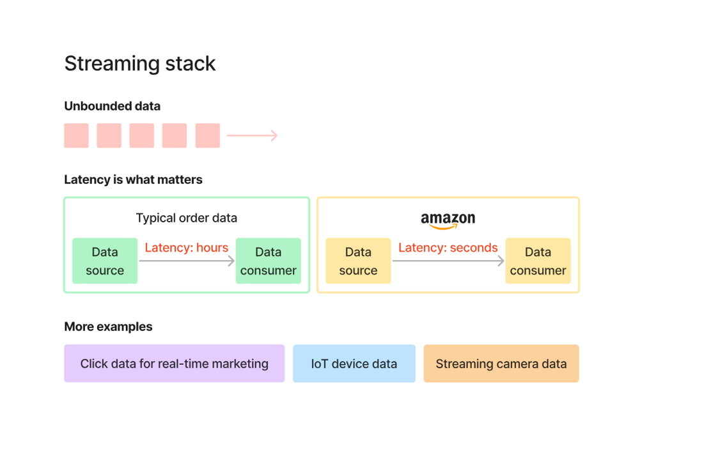
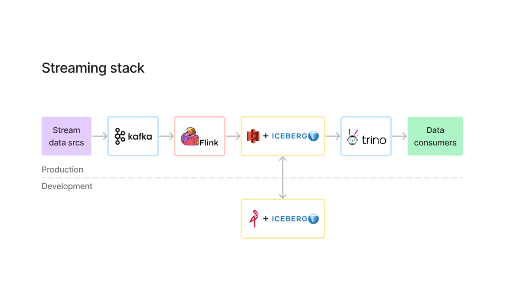
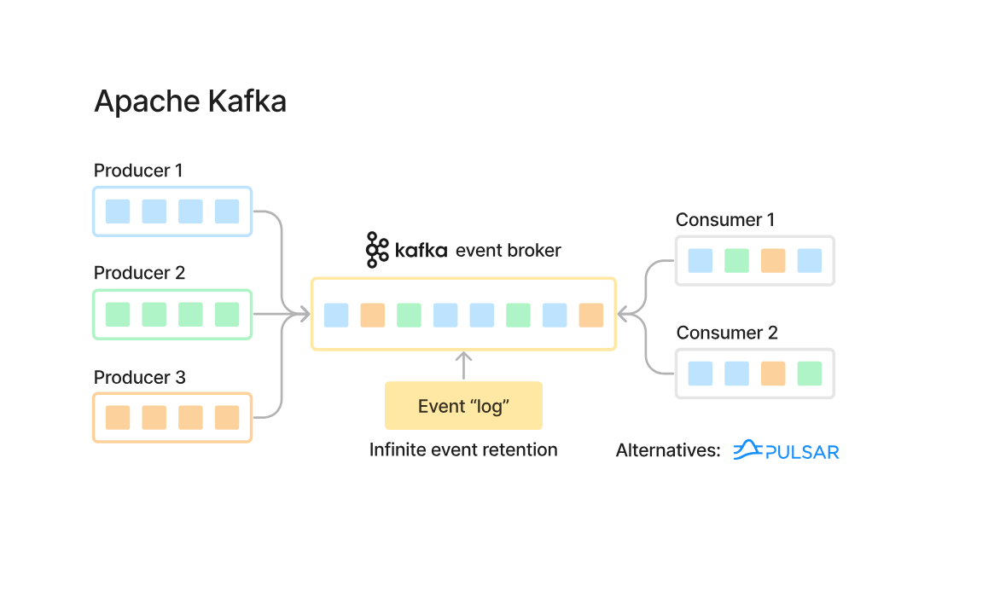

# Streaming in Data Engineering

---

## 1. When Do We Need Streaming?

Streaming is used when **low latency and real-time data processing are required**.

### Batch Processing (No Streaming Needed)
- Data arrives in intervals (daily/hourly)
- Example:
  - CSV files uploaded to S3
  - Reports generated periodically

> Latency: Minutes to Hours

---

### Streaming Processing (Required)

- Data is continuous (unbounded)
- Needs near real-time processing

Examples:
- Real-time marketing (clickstream data)
- IoT device data (Uber, sensors)
- Streaming video/camera data
- Fraud detection systems

> Latency: Seconds or milliseconds

---

## 2. Key Concept: Unbounded Data

Streaming deals with **unbounded data**, meaning:
- Data never stops
- It keeps flowing continuously

---

## 3. Streaming Stack Overview

A typical modern streaming architecture includes:

1. **Data Sources**  
   Applications, sensors, user activity  

2. **Kafka (Ingestion Layer)**  
   - Acts as a distributed event streaming platform  
   - Stores events as logs  

3. **Processing Layer (Flink)**  
   - Processes data in real time  
   - Applies transformations  

4. **Storage Layer (S3 + Iceberg)**  
   - Stores processed data  
   - Supports analytics  

5. **Query Layer (Trino)**  
   - Used for querying data  

6. **Data Consumers**  
   - Dashboards  
   - ML systems  
   - Reverse ETL  

---

## 4. Apache Kafka (Core Concept)

Kafka is the backbone of most streaming systems.

### How Kafka Works

- **Producers** → Send data (events)
- **Kafka Broker** → Stores events in logs
- **Consumers** → Read data independently

---

### Key Features

- Distributed and scalable  
- Stores data as an **event log**  
- Supports multiple consumers  
- High throughput  

---

### Important Clarification

Kafka:
- Does NOT directly store data in S3  
- Stores data internally as logs  

Integration with S3 is done using connectors.

---

## 5. Final Takeaways

- Not all systems need streaming  
- Use streaming only when latency matters  
- Kafka is used for ingestion of real-time data  
- Streaming systems handle continuous, unbounded data  

> Batch = Simple + Cost-effective  
> Streaming = Complex + Real-time power
