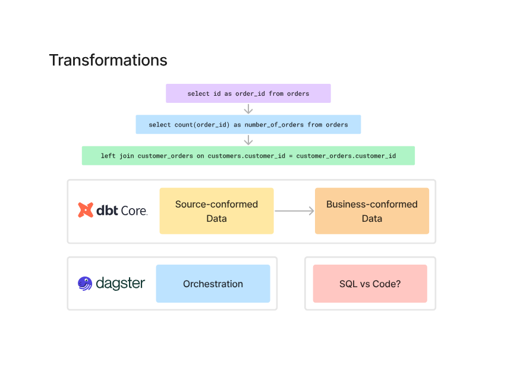
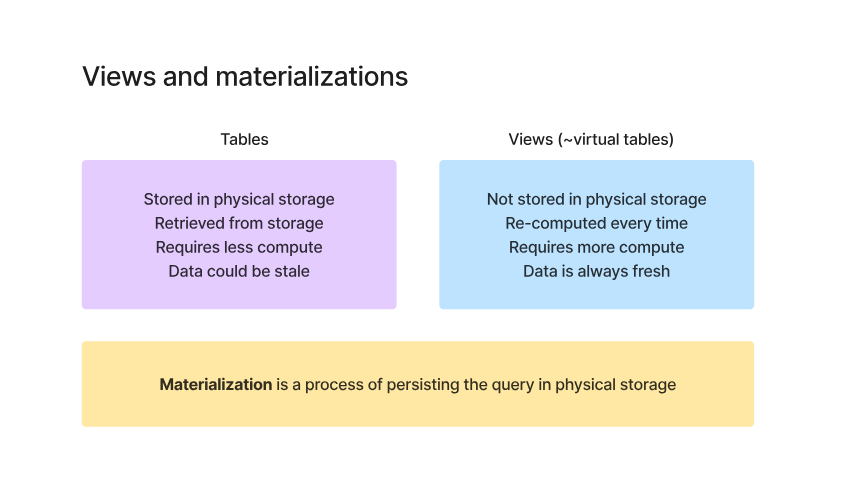

# 🔄 Transformations, dbt, Dagster & Materialization

---

## ⚙️ What transformations actually mean



Raw data → cleaned → joined → aggregated → usable

Simple example:

* select id
* count orders
* join tables

Basically:
👉 turning raw data into business-ready data

---

## 🔧 What dbt Core actually is

dbt is NOT:

* a database
* a storage system

dbt is just:
👉 a transformation tool

You write SQL, dbt runs it in your warehouse.

---

### What dbt really does

* takes raw tables
* applies transformations (SQL)
* builds new tables/views

That’s it.

---

### Important thing

dbt works on:
👉 already stored data

It doesn’t ingest data
It doesn’t schedule jobs

It only transforms.

---

## 🧠 Source vs Business data

* Source-conformed → raw cleaned data
* Business-conformed → final usable data

dbt sits in between these two.

---

## 🚦 Then what is Dagster?

Dagster is:
👉 orchestration

Meaning:

* when to run
* what to run
* in what order

---

### Simple way to see it

* dbt → *what transformation to do*
* Dagster → *when to run it*

---

## ⚡ Where materialization comes in

Now this is the important part.

When you write a dbt model (SQL), you must decide:

👉 how should this result be stored?

That decision = **materialization**

---

## 📦 Tables vs Views



### Tables

* stored physically
* fast to read
* can become stale

---

### Views (virtual tables)

* not stored
* computed every time
* always fresh
* slower

---

## 🔥 So what is materialization?

Materialization =
👉 how the result of a query is persisted

---

### In dbt, you choose:

* table → store result physically
* view → compute every time
* incremental → update only new data

---

## ⚡ Why this matters

Same SQL:

```sql
select * from orders
```

Can behave very differently:

* as a **view** → runs every time
* as a **table** → stored once
* as **incremental** → partially updated

---

## 🧠 Real understanding

* Query = logic
* Materialization = storage decision

---

## ⚠️ Trade-off

| Type        | Pros         | Cons            |
| ----------- | ------------ | --------------- |
| View        | Always fresh | Slow            |
| Table       | Fast         | Can be outdated |
| Incremental | Efficient    | Complex logic   |

---

## 🔥 My takeaway

* dbt = SQL transformation layer
* Dagster = pipeline control layer
* Materialization = performance + storage decision

👉 Same logic, different behavior based on materialization

---
