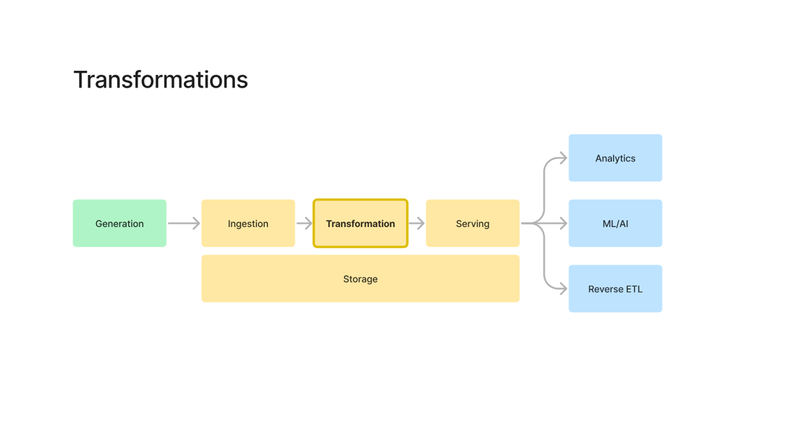
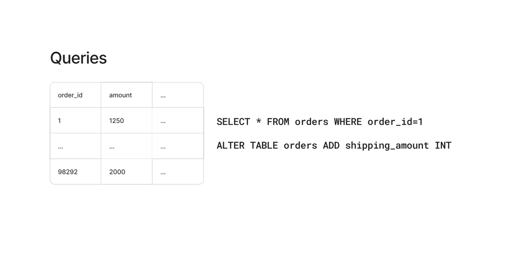
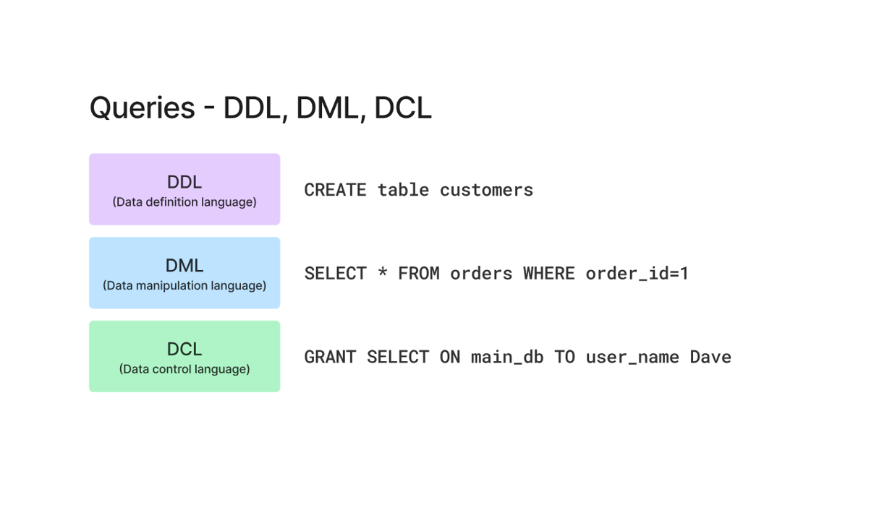
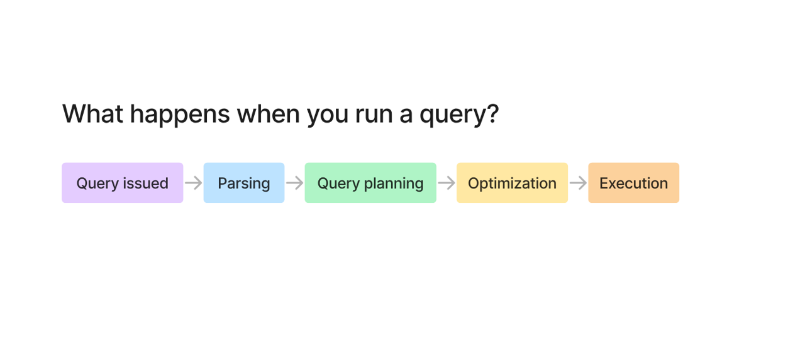
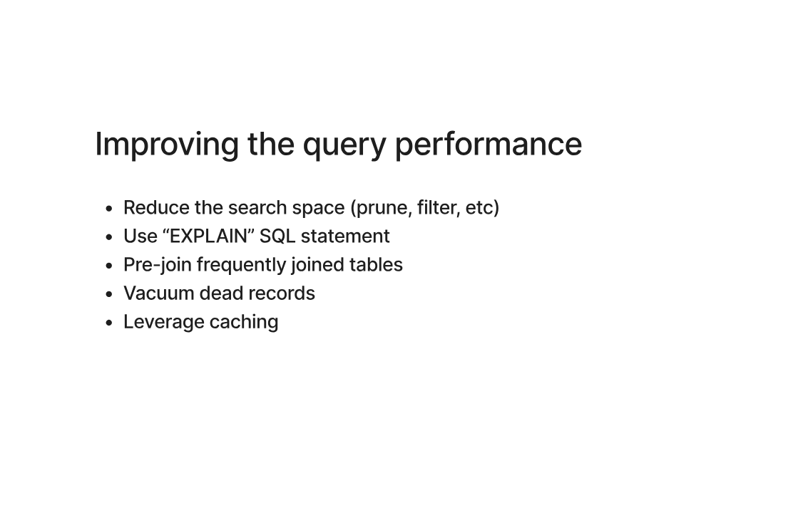
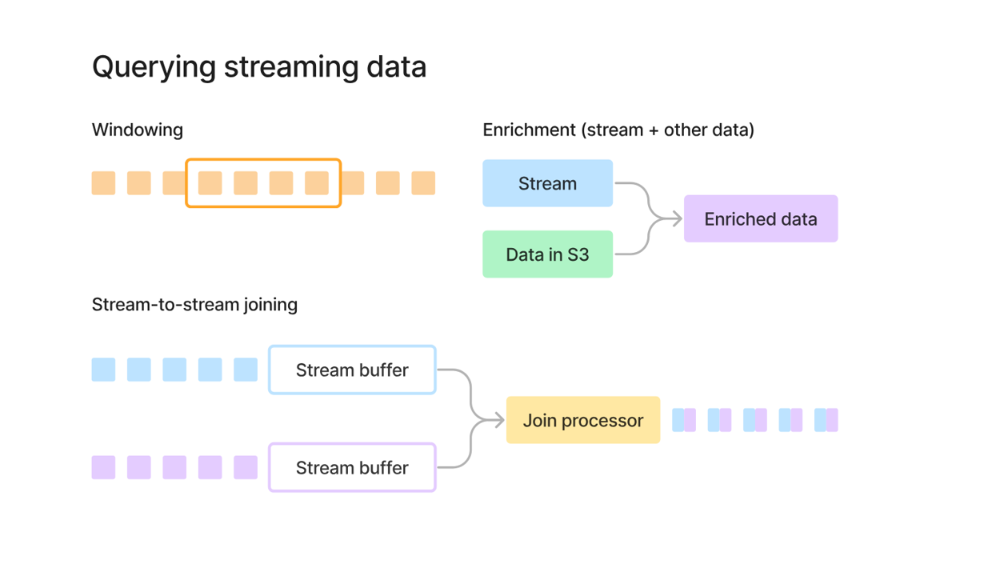

# 📘 Transformations & Query Processing

---

## 🔄 Where transformations actually sit

Pipeline is simple:

* Generation → Ingestion → Transformation → Serving

Storage is always there in the background.

What actually clicked for me here is:
👉 Transformation is where the real value happens

Raw data is useless.
Only after transformation it becomes usable for:

* Analytics
* ML
* Reverse ETL

---

## 🧠 Queries (basic understanding)

Simple stuff but important:

* SELECT → read data
* ALTER → change structure

Basically:
👉 Queries = how we talk to data

---

## ⚙️ DDL vs DML vs DCL

I used to mix this up, but it’s actually simple:

* DDL → structure

  * CREATE, ALTER

* DML → data

  * SELECT, INSERT, UPDATE

* DCL → permissions

  * GRANT, REVOKE

---

## ⚡ What actually happens when I run a query

This was interesting.

When I run a query, it’s not directly executed.

Steps:

1. Query issued
2. Parsing → check syntax
3. Query planning → how to run
4. Optimization → make it efficient
5. Execution → finally runs

👉 So DB is not dumb — it actually thinks before running

---

## 🚀 Improving query performance

Things that actually matter:

* Reduce search space (filter early)
* Use EXPLAIN (understand query plan)
* Pre-join data if needed
* Remove useless data (vacuum)
* Use caching

Main idea:
👉 Don’t make DB do unnecessary work

---

## 🌊 Querying streaming data

This part is different from normal queries.

Data is not sitting in a table.
It is continuously coming.

---

### 🧠 Windowing

Instead of full data, we process chunks:

* last 5 minutes
* last 1 hour

👉 Because infinite data cannot be processed at once

---

### 🔗 Stream + batch (enrichment)

* Stream data
* Combine with stored data (S3)

👉 This makes data more useful

---

### 🔄 Stream-to-stream join

* Two streams coming in
* Buffers hold data temporarily
* Then join happens

👉 This is tricky because data is continuous

---

## 💥 What I understood overall

* Transformation is where data becomes useful
* Queries are not direct — DB plans them
* Performance is about reducing unnecessary work
* Streaming is a completely different mindset
