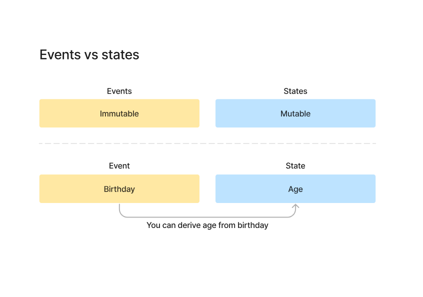
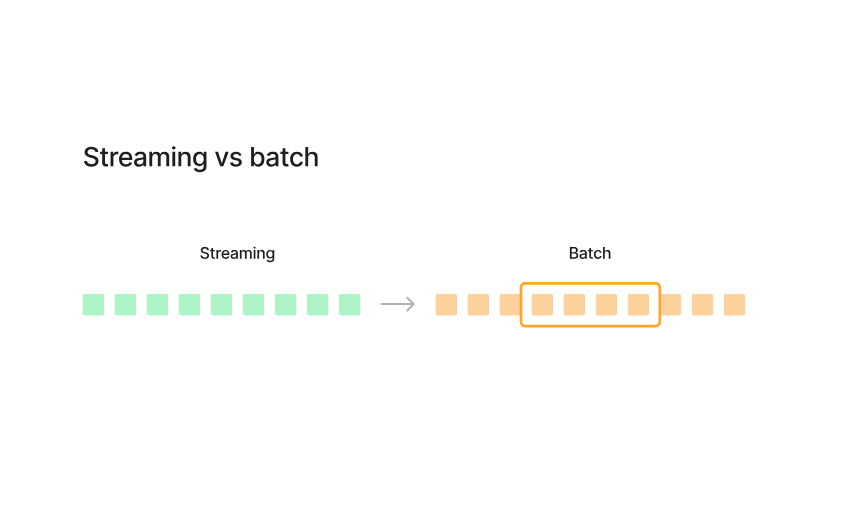

# 🔄 Transformations — Events, States, Streaming vs Batch

---

## 📌 Events vs States

Events = immutable
States = mutable

Example:

* Event → birthday
* State → age

👉 Age changes
👉 Birthday never changes

So:
👉 States can be derived from events

---

## 🌊 Streaming vs Batch

### Streaming

* Continuous stream of data
* Continuous stream of immutable events

👉 Data keeps coming non-stop

* Requires more compute
* More costly
* Designed for low latency

Used for:

* real-time systems
* live dashboards
* fraud detection

---

### Batch

Batch is NOT something separate.

👉 Batch = a window over streaming data

Example:

* 1 hour of data
* 1 day of data

That slice = batch

---

### Key understanding

Streaming:
👉 infinite continuous data

Batch:
👉 fixed chunk of that data

---

### Batch characteristics

* Can be sorted
* Can be aggregated
* Easier to process

But:

* Not suitable for low latency
* Not real-time

---

## 🔥 My takeaway

* Streaming = real-time, expensive, continuous
* Batch = grouped data, cheaper, delayed

👉 Batch is just a window on streaming

---
